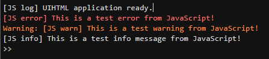
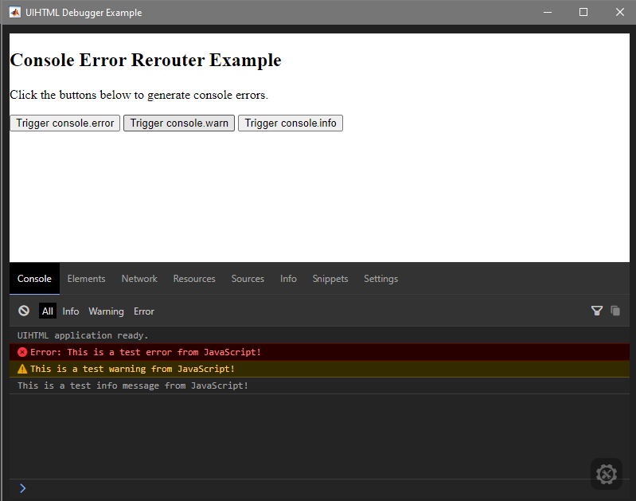

# UIHTML Debugger for MATLAB

[](https://github.com/PVDecker1/uihtml-debugger/actions/workflows/matlab-tests.yml)
[](https://codecov.io/github/PVDecker1/uihtml-debugger)
[](https://opensource.org/licenses/MIT)

The UIHTML Debugger is a non-intrusive toolkit designed to bridge the gap between MATLAB and JavaScript development. It provides two essential tools to streamline web-based UI development within MATLAB:

1.  **Console Error Rerouter**: Forwards console.log, warn, and error messages directly to the MATLAB Command Window.
1.  **UIHTML DevTools**: Injects Eruda—a full-featured mobile-style console—directly into your UI for deep inspection without leaving the MATLAB environment.

---

## Requirements

*   **MATLAB R2023a** or later.
*   **Base MATLAB** (no additional toolboxes required).

---

## Features

*   **Zero-Configuration Rerouting**: View JavaScript errors in the MATLAB Command Window in real-time.
*   **Integrated Inspector**: Inspect elements, view network requests, and execute JavaScript snippets via the injected Eruda console.
*   **Non-Intrusive Integration**: Utilizes addlistener to avoid conflicts with existing HTMLEventReceivedFcn handlers.
*   **Automated Cleanup**: Temporary injected files are automatically removed upon object destruction to prevent file accumulation.
*   **Configurable Interception**: Define specific console levels to intercept and customize output formatting.

---

## Visual Demonstration

### 1. Console Rerouting


### 2. In-App DevTools (Eruda)


---

## Getting Started

### 1. Requirement: The setup Hook
To enable communication between the debugger and your UI, your HTML file must define a global `setup(htmlComponent)` function. This is the standard pattern for bidirectional communication in MATLAB uihtml components.

```javascript
// index.html
function setup(htmlComponent) {
    console.log("Application initialized");
}
```

### 2. Basic Usage in MATLAB

```matlab
fig = uifigure;
h = uihtml(fig, 'HTMLSource', 'index.html');

% Tool 1: Console Rerouter
% Forwards JavaScript messages to the Command Window
rerouter = ConsoleErrorRerouter(h);
rerouter.ErrorLevels = ["error", "warn", "log"]; % Optional configuration

% Tool 2: DevTools
% Injects the Eruda inspector icon into the UI
devTools = UIHTMLDevTools(h);
```

---

## Examples

Ready-to-run scripts are available in the `toolbox/examples/` directory:
*   `devtools_usage.m`: A comprehensive demonstration showing both tools working in tandem.
*   `basic_usage.m`: A minimal example focusing on console rerouting.
*   `custom_formatting.m`: Instructions on customizing the appearance of rerouted messages.

---

## Testing

The project includes a comprehensive test suite with over 85% code coverage. To verify the installation, run the following command in MATLAB:

```matlab
results = runtests('tests/tUIHTMLDevTools.m');
disp(results);
```

---

## Credits and Acknowledgments

This project utilizes **[Eruda](https://github.com/liriliri/eruda)**. Eruda's mobile-first console interface provides a professional-grade debugging environment within the technical constraints of the MATLAB uihtml component.

---

## License

This project is licensed under the MIT License. See the [LICENSE](LICENSE) file for details.
